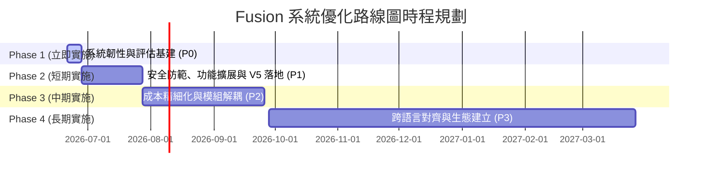

# OpenRouter Fusion 系統優化路線圖與效益評估報告 (Roadmap)

> **文件狀態**：正式發佈  
> **關聯報告**：[OpenRouter Fusion 深度技術研究報告](file:///e:/WORK/Fusion/openrouter_fusion_research.md)  
> **核心目標**：推動本專案的 Fusion 系統從「實驗性實作」走向「生產級高可用」，並實現量化效益評估。

---

## 📅 系統優化路線圖 (Roadmap)

本路線圖共分為四個階段，旨在平衡系統韌性、成本控制、寫作/開發品質以及生態擴展。

### 📌 階段總覽與優先級



---

### 🔍 階段詳細規劃與效益評估

#### Phase 1：立即實施 (1 週內) — 系統韌性與評估基建 (Priority: P0)
此階段著重於解決系統執行時的單點故障風險，並建立成效度量標準。

| 序號 | 改進項目與具體行動 | 預期效益評估 | 優先級 |
| :--- | :--- | :--- | :---: |
| **1** | **實作 `failed_models[]` 結構化追蹤**<br>在 parallel task 調用中加入異常捕獲 (try-catch)。若單一 Panel 模型故障（超時、API 限流），將其標記並記錄於 `failed_models` 陣列，其餘正常 Panel 的結果照常呈送給 Judge。 | **【提升容錯率，阻斷全盤崩潰】**<br>將單點故障導致的任務失敗率從 100% 降為局部降級運行；並在報告中顯式標記出錯模型，縮短排查除錯時間。 | **P0** |
| **2** | **實作 Judge Fail Fallback 機制**<br>若最終的 Judge 模型因 Rate Limit 或 API 報錯失效，系統自動降級為直接將各個 Panel 的「原始回答 (Raw Responses)」合併呈現給用戶，跳過綜合裁判，但不丟失已產出的文本。 | **【保護高成本 Token 產出】**<br>避免因 Judge 單點崩潰而使前期 parallel panels 已消耗的 Token 費用付諸流水，保障運行經濟安全性。 | **P0** |
| **3** | **建立內部評估框架 (ResearchData/LLM Benchmark)**<br>選取 10-15 題涵蓋代碼生成、重構、Bug 修復與網文寫作的標準題目，建立基準量表，用於持續量化測試 Solo vs 各級 Fusion 的表現。 | **【建立量化依據，避免盲目調參】**<br>為後續優化方案（例如將 Plot Flash 換成 GLM-5.2）提供客觀的數據證明，使每次升級的「性價比」可被計算。 | **P0** |

> [!NOTE]
> **P0 評估面向詳細設計** (沿用 `ResearchData/LLM` 架構)：
> *   **程式碼生成** (gen_001~004)：基本函式、資料結構 (LRU Cache)、API 模組、SQL 生成。
> *   **程式碼解釋** (exp_001~002)：演算法解釋、閉包與作用域。
> *   **程式碼重構** (ref_001~002)：函式重構、設計模式應用 (策略模式)。
> *   **Bug 修復** (bug_001~002)：邏輯錯誤、並發競爭 (BankAccount) 修復。
> *   **語言轉換** (trans_001~002)：Python 轉 Go、JS 轉 Rust。
> *   **邏輯推理** (reason_001~002)：數學推理、分散式系統設計 (Rate Limiter)。
> *   **技術文件** (doc_001~002)：JSDoc 生成、README 生成。
> 
> **評分維度**：正確性 (35%)、可讀性 (20%)、效率 (15%)、完整性 (15%)、慣用性 (15%)。並引入 Checklist 違規扣分機制。
> **裁判隔離**：評分時採用獨立的旗艦模型作為 Referee，避免 Judge 與 Panel 存在同家族偏差。

---

#### Phase 2：短期實施 (1 個月內) — 安全防範、功能擴展與 V5 落地 (Priority: P1)
此階段著重於防範成本失控、拓展高頻使用場景，並將「GLM 創意發散流」正式落地。

| 序號 | 改進項目與具體行動 | 預期效益評估 | 優先級 |
| :--- | :--- | :--- | :---: |
| **1** | **加入遞迴保護機制 (Fusion Depth Tracking)**<br>在 Agent Context 中注入 `fusion-depth` 計數器（上限設為 1）。嚴禁 Panel 子代理在運行中二次調用 Fusion 技能，若有則直接攔截並強制降級為單模型回答。 | **【徹底杜絕 API 帳單爆炸風險】**<br>防止 Panel Agent 因邏輯循環或提示詞引引導，意外陷入無限嵌套的 Fusion 調用，保障資金安全。 | **P1** |
| **2** | **落地「方案二：GLM 創意發散流」**<br>修改配置，將小說編輯流水線中的 Plot Editor 正式由 `deepseek-v4-flash` 升級為 **`glm-5.2`**。 *(詳細分析見下文專章)* | **【解除評審天花板】**<br>將情節評判眼界拉升至 #4 頂級中文模型，預期使寫作與情節審核的最終品質得分提升 **+0.3~+0.5 分**。 | **P1** |
| **3** | **引入結構化 JSON Judge 輸出模式**<br>允許 Judge 除了 Markdown 外，亦可輸出結構化的 JSON 報告（包含 consensus、blind_spots 等 key-value）。 | **【提升 Agent 管道的可程式化性】**<br>使 Fusion 分析結果能直接被下游自動化重構或除錯工具（如自動修補 Agent）進行二次消費與解析。 | **P1** |
| **4** | **設計 Code Review / Architecture 專用 Skill**<br>將小說 3+1 編輯流水線的成功經驗，移植並設計為「代碼與架構評審」專屬的 Fusion 工作流。 | **【擴展高頻開發防線】**<br>在開發難題（如併發競爭、底層設計模式）的第一時間，藉由多模型平行盲測阻斷幻覺，提升代碼安全性。 | **P1** |

---

#### Phase 3：中期實施 (3 個月內) — 成本精細化與模組解耦 (Priority: P2)
此階段著重於優化日常使用的 Token 浪費，並使底層引擎具備移植能力。

| 序號 | 改進項目與具體行動 | 預期效益評估 | 優先級 |
| :--- | :--- | :--- | :---: |
| **1** | **Progressive Fusion (漸進式啟動)**<br>核心管理模型先進行一輪超輕量評估。簡單的代碼查表問題直接單模型回答；唯有遇到複雜決策、架構權衡時，才觸發平行 Fusion。 | **【優化日常使用成本】**<br>預期降低日常開發中 **30%~50%** 的不必要 Token 消耗，避免「殺雞用牛刀」。 | **P2** |
| **2** | **Fusion Memory (最佳組合路由)**<br>自動記錄不同問題分類下，各模型組合在歷史 Benchmark 中的表現，智能動態路由最匹配的 Panel 陣容。 | **【自適應品質最大化】**<br>針對特定技術領域（如資料庫優化與前端 UI），自動適配出最高效的評審團，提升最終回答品質。 | **P2** |
| **3** | **抽取 Fusion Engine 核心模組**<br>將調度、Judge 融合、容錯與 fallback 機制封裝為獨立的 JS 模組，減少對特定 IDE task() API 的強綁定。 | **【提升移植性與多端部署能力】**<br>便於將此套多模型協同技術移植至常規 CLI、網頁端或獨立 Agent 工作流中。 | **P2** |

---

#### Phase 4：長期實施 (6-18 個月) — 跨語言對齊與生態建立 (Priority: P3)

*   **多語言專用 Fusion 配置**：設計中英文雙語對齊的 Prompt 與雙語對齊的 Judge 審查規則。
    *   *效益評估*：**【消除隱性語意損失】**。解決英文模型在中文語境下所產生的翻譯偏見或語意扭曲，提升跨國技術研究的準確度。
*   **建立社群 Skill 生態系統**：開放 Fusion Engine 的 Panel 角色註冊標準，允許社群貢獻不同專業領域（例如法律、金融、醫學、安全審計）的專業編輯 Panel。
    *   *效益評估*：**【推動社群協同進化】**。使 Fusion 從「寫作/開發工具」蛻變為「全領域多專家盲測分析平台」。

---

## 🚀 專項優化：V5 「GLM 創意發散流」實踐方案

在 Fiction Editor V4 專業編輯流水線中，專職「情節與節奏」的 Plot Editor 模型 `deepseek-v4-flash` 自身寫作排名偏低 (#18)，為了防止其評審眼界限制整體打分上限，本專案將在 Phase 2 正式推行 **GLM 創意發散流** 升級方案。

### 1. V5 優化流水線架構設計

```
  [ 小說正文草稿 ]
         │
         ├──► Plot Editor      : opencode-go/glm-5.2      ( 專攻：節奏、開篇吸引力 ) -- *V5 升級*
         ├──► Character Editor : opencode-go/qwen3.7-plus ( 專攻：人物性格、幽默、對話 )
         └──► Prose Editor     : opencode-go/mimo-v2.5    ( 專攻：年代感、冷硬文筆 )
         │
         ▼
  [ 三位編輯的 Parallel Reports ]
         │
         ▼
  [ Editor-in-Chief (Judge) ] : opencode-go/deepseek-v4-pro ( 終審、裁決、給出修改建議與最終評分 )
```

### 2. 核心優勢與效益

1.  **打分專業度與評審深度大幅拉升**：
    GLM 系列在中文理解與邏輯推理上表現極佳，前代 GLM-5 寫作排名高達 **#4**。將 Plot 編輯替換為 `glm-5.2`，能讓真正理解網文情節節奏與開篇吸引力的模型進行專項把關，解決了原 Flash 模型的評審天花板問題。
2.  **嚴格迴避裁判偏差 (Judge Bias Avoidance)**：
    雖然更換為更高階的旗艦/次旗艦模型，但本專案否決了直接使用 `DeepSeek V4 Pro` 的方案（避免總編與 Plot 編輯同架構偏聽）。GLM (智譜) 與 DeepSeek (總編) 為完全獨立的不同架構，最大化保留了多維度盲測的客觀性。

### 3. Token 成本與性價比試算

以評改 **3,000 字** 小說一章為計算標準（約合 Panel 輸入 6K Tokens、Panel 報告輸出 1.2K Tokens、Judge 輸入 11K Tokens、最終修改全文輸出 5K Tokens）：

| 指標 | 現行 V4 流水線 | V5 GLM 方案 | 變動與增幅 |
| :--- | :--- | :--- | :--- |
| **Plot 編輯模型** | `deepseek-v4-flash` | `glm-5.2` | 升級為高階次旗艦 |
| **每章總成本** | $0.0432 USD | **$0.0557 USD** | **+$0.0125 USD** |
| **百分比增幅** | 基準 (100%) | 128.9% | **+28.9%** |
| **性價比評估** | 成本極低，但 Plot 審查存在瓶頸 | 解除審查天花板，寫作與情節審核品質預期提升 **+0.3~+0.5 分** | **極高**（每精修 100 章僅增加約新台幣 39 元） |

> [!TIP]
> **結論**：試算結果證明，以極低邊際成本換取高階模型評審深度的可行性，完全符合商業部署與日常開發的性價比要求。
