# OpenRouter Fusion 深度技術研究報告

> 研究日期：2026-06-20（初版）、2026-06-21（深度 Fusion 分析更新）  

> 資料來源：OpenRouter Blog, API Docs, Server Tools Docs, Plugin Docs  

> 參考文章：[Surpassing Frontier Performance with Fusion](https://openrouter.ai/blog/announcements/fusion-beats-frontier/)  

> 分析方式：使用本專案 fusion-research skill 進行 4-panel 多模型協同分析（Judge: DeepSeek V4 Pro）

## 📖 報告目錄

*   [一、什麼是 OpenRouter Fusion？](#一什麼是-openrouter-fusion)
*   [二、系統架構](#二系統架構)
*   [三、技術細節](#三技術細節)
*   [四、關鍵發現](#四關鍵發現)
*   [五、限制與注意事項](#五限制與注意事項)
*   [六、opencode Fusion Skill 實作現況](#六opencode-fusion-skill-實作現況)
    *   [6.4 Skill 方案的四種 Tier](#64-skill-方案的四種-tier)
*   [七、參考資料](#七參考資料)
*   [八、Fusion Research 深度分析報告（2026-06-21）](#八fusion-research-深度分析報告2026-06-21)
    *   [8.6 改進行動路線圖與效益評估](#86-改進行動路線圖與效益評估)
*   [九、工作流對比：Fusion 與其他多模型協同模式的本質差異](#九工作流對比fusion-與其他多模型協同模式的本質差異)
*   [十、基於 Fiction Editor V3 vs V4 Benchmark 的 Fusion 實踐分析](#十基於-fiction-editor-v3-vs-v4-benchmark-的-fusion-實踐分析)
    *   [10.5 針對 Plot 評審偏差的優化調整方案 (V5 實踐與展望)](#105-針對-plot-評審偏差的優化調整方案-v5-實踐與展望)
*   [十一、核心本質思辨：評分消弭與分工本質 (單一模型深度思辨)](#十一核心本質思辨評分消弭與分工本質-單一模型深度思辨)
*   [十二、Antigravity 2.0 架構下的 Fusion 適配與 Self-Fusion 實踐指南](#十二antigravity-20-架構下的-fusion-適配與-self-fusion-實踐指南)


---

> [!IMPORTANT]
> **關於本報告涵蓋的兩種運作模式**
>
> 本報告同時涵蓋兩種 Fusion 運作模式，請勿混淆：
>
> | 模式 | 對應章節 | 核心做法 | 對應實作 |
> |------|---------|---------|---------|
> | **真·多模型 Fusion** | §1–§10 | 不同架構模型（Kimi/Qwen/Gemini/Claude…）平行盲測，Judge 為另一架構 | `.opencode/skills/`（需多模型 token 環境） |
> | **單模型 Self-Fusion** | §11–§12 | 同一底層模型 ×2，靠角色化 system prompt 區分視角，同模型 Judge | `.agents/skills/`（Antigravity 等單模型 IDE） |
>
> 兩者**並非互斥或矛盾**。OpenRouter 原始研究即同時提供「不同模型組合」與「同模型 ×2（Self-Fusion）」兩種合法選項。效能優先序為：**不同架構模型組合 > 同模型 ×2（Self-Fusion）> 單一模型直答**。Self-Fusion 在 DRACO 上相較單模型有明確提升（Opus 4.8: 58.8%→65.5%），但在 Antigravity 單模型環境下的實際增益尚未經本專案 Benchmark 量化。

---

## 一、什麼是 OpenRouter Fusion？

Fusion 是 OpenRouter 在 2026 年 5 月推出的多模型協同推論系統。其核心思想是：**將同一個提示同時發送給多個不同架構的模型，由一個 Judge 模型分析所有回覆的共識與差異，最後由外層模型產出綜合性答案。**

測試結果顯示，Fusion 在 DRACO deep research benchmark（100 項任務、10 個領域）上超越了所有單一前沿模型，包括 Claude Fable 5 和 GPT-5.5。

### 核心分數

| 類型 | 模型組合 | 分數 |

|------|---------|------|

| Fusion | Fable 5 + GPT-5.5 (Judge: Opus 4.8) | **69.0%** |

| Fusion | Opus 4.8 + GPT-5.5 + Gemini 3.1 Pro (Judge: Opus 4.8) | **68.3%** |

| Fusion | Opus 4.8 + GPT-5.5 (Judge: Opus 4.8) | **67.6%** |

| Solo | Claude Fable 5 | 65.3% |

| Fusion | Gemini 3 Flash + Kimi K2.6 + DeepSeek V4 Pro (Judge: Opus 4.8) | **64.7%** |

| Solo | DeepSeek V4 Pro | 60.3% |

| Solo | GPT-5.5 | 60.0% |

| Solo | Claude Opus 4.8 | 58.8% |

---

## 二、系統架構

### 2.1 完整 Pipeline

```

User Request

  │

  ▼

Outer Model（接收提示，決定何時調用 Fusion）

  │

  ├── 簡單問題 → 直接回答（不觸發 Fusion）

  │

  └── 複雜/研究型問題 → 調用 openrouter:fusion tool

        │

        ▼

      Panel（1~8 個模型，平行執行）

        │   每個模型附帶 web_search + web_fetch

        │   各自獨立產生回應

        │

        ▼

      Judge（分析模型）

        │   接收所有 panel 回應

        │   產出結構化 JSON：

        │   ├── consensus（共識）

        │   ├── contradictions（矛盾點）

        │   ├── partial_coverage（部分覆蓋）

        │   ├── unique_insights（獨特見解）

        │   └── blind_spots（盲點）

        │

        ▼

      Outer Model 接收 Analysis JSON

        │

        ▼

      Final Answer（綜合後的最終輸出）

```

### 2.2 三種接入方式

| 方式 | 說明 | 適用場景 |

|------|------|---------|

| **Model Slug** | 直接指定 `model: "openrouter/fusion"`，自動注入預設 panel | 最簡單，一鍵切換 |

| **Server Tool** | 在 tools 陣列中加入 `{ type: "openrouter:fusion" }`，由模型自行決定何時調用 | 最大控制權，可與其他 tools 搭配 |

| **Plugin** | 在 plugins 陣列中配置 `{ id: "fusion", ... }`，可自訂 panel 組合與 judge | 介於兩者之間，結構化配置 |

三種方式共用同一套後端 pipeline。

---

## 三、技術細節

### 3.1 Panel 配置參數

| 參數 | 預設值 | 說明 |

|------|--------|------|

| `analysis_models` | Quality preset（Opus + GPT + Gemini） | Panel 模型列表，1~8 個 |

| `model` | 同外層模型 | Judge 模型 |

| `max_tool_calls` | 8 | Panel/judge 的 tool call 上限（1~16） |

| `max_completion_tokens` | Provider 預設 | 輸出 token 上限 |

| `reasoning` | Provider 預設 | 推理配置（effort / max_tokens） |

| `temperature` | Provider 預設 | 採樣溫度 (0~2) |

### 3.2 Judge 輸出格式

成功時回傳：

```json

{

  "status": "ok",

  "analysis": {

    "consensus": ["所有或大部分 panel 模型同意的點"],

    "contradictions": [

      { "topic": "...", "stances": [{ "model": "...", "stance": "..." }] }

    ],

    "partial_coverage": [

      { "models": ["..."], "point": "僅部分模型涵蓋此面向" }

    ],

    "unique_insights": [

      { "model": "...", "insight": "僅單一模型提出的觀點" }

    ],

    "blind_spots": ["所有 panel 模型都未觸及的主題"]

  },

  "responses": [

    { "model": "anthropic/claude-opus-4.5", "content": "..." }

  ]

}

```

### 3.3 優雅降級機制

| 情境 | 行為 |

|------|------|

| Judge 失敗但 panel 成功 | 回傳 `status: "ok"`，省略 analysis，保留 raw responses |

| 部分 panel 失敗 | 回傳 `status: "ok"`，附加 `failed_models[]` |

| 全部 panel 失敗 | 回傳 `status: "error"`，包含 typed `failure_reason` |

| 同次請求中第二次調用 | 被 `fusion_invocation_capped` 拒絕（單層遞迴保護） |

### 3.4 Preset 系統

OpenRouter 提供預設 panel 組合，免除手動選模型：

| Preset | 用途 |

|--------|------|

| `general-high` | 頂級通用 panel（最強模型組合） |

| `general-budget` | 平價 panel + 前沿 judge（成本約 50%） |

---

## 四、關鍵發現

### 4.1 Self-Fusion 效應

將 Opus 4.8 與自己配對（Opus 4.8 × 2，同樣由 Opus 4.8 做 judge）：

- Solo Opus 4.8：**58.8%**

- Self-Fusion Opus 4.8：**65.5%（+6.7 分）**

這表明 **synthesis 步驟本身就帶來顯著提升**——同一模型跑兩次會產生不同的推理路徑、不同的 tool call 選擇、不同的來源引用，而 Judge 的融合分析能從中萃取出更好的結果。

### 4.2 模型多樣性的價值

不同架構模型（Claude / GPT / Gemini / DeepSeek / Kimi）各有其推理風格與擅長領域，組合在一起能有效涵蓋彼此的盲點。

### 4.3 性價比突破

平價 panel（Gemini 3 Flash + Kimi K2.6 + DeepSeek V4 Pro）+ Opus 4.8 Judge：

- 分數：64.7%（接近 Fable 5 的 65.3%）

- 成本：約 Fable 5 的 **50%**

---

## 五、限制與注意事項

1. **延遲成本**：Fusion 調用時約為普通請求的 2~3 倍時間（等待多個模型 + Judge 分析）

2. **非編碼替代品**：Fusion 不適合作為 coding 模型的直接替代——建議用於架構決策或研究類問題，常規編碼由編碼模型直接處理

3. **測試局限**：DRACO 僅涵蓋文本、英文任務，且靜態 task set 可能無法全面泛化至未來應用場景

4. **Judge 偏差**：絕對分數會隨 Judge 模型選擇而變化（論文報吿 10~25 分差異），但相對排名穩定

5. **不包含長時序任務**：Fable 5 這類擅長長時間任務的模型，其優勢不在 DRACO 的評測範圍內

---

## 六、opencode Fusion Skill 實作現況

### 6.1 架構總覽

本專案已實作完整的多模型 Fusion Skill 系統，運行於 opencode 編輯器內：

```

opencode.jsonc (中央配置，預設模型 DeepSeek V4 Pro)

  ├── Skills (2 個): fusion-research, fiction-editor

  ├── Research Panels (8 個): fusion-deepseek, fusion-kimi, fusion-qwen,

  │     fusion-glm, fusion-gemini, fusion-thirdparty, fusion-budget-ds, fusion-budget-mimo

  └── Fiction Panels (3 個): fusion-fiction-plot, fusion-fiction-character, fusion-fiction-prose

Pipeline:

  1. Triage (AI 判斷問題是否需要 Fusion)

  2. Prompt Design (為每個 panel 設計不同視角的 prompt)

  3. Parallel Dispatch (task() 工具平行啟動 2-4 panel subagent)

  4. Judge Synthesis (主 AI 綜合分析：共識/分歧/獨特見解/盲點)

  5. Self-Evaluation (信心水準)

```

### 6.2 模型多樣性（6 個 Provider、8 個不同架構）

| Agent | Model | Provider | 用途 |

|-------|-------|----------|------|

| fusion-deepseek | deepseek-v4-pro | DeepSeek | 技術深度、程式推理 |

| fusion-kimi | kimi-k2.7-code | Moonshot | 程式架構、邏輯流 |

| fusion-qwen | qwen3.7-plus | Alibaba | 綜合分析、廣域脈絡 |

| fusion-glm | glm-5.2 | Zhipu | 創意思考、替代視角 |

| fusion-gemini | gemini-3.5-flash | Google | 跨域觀點、實務約束 |

| fusion-thirdparty | claude-haiku-4.5 | Anthropic (第三方) | 細緻權衡、安全倫理 |

| fusion-budget-ds | deepseek-v4-flash | DeepSeek | 快速平價分析 |

| fusion-budget-mimo | mimo-v2.5 | MiMo | 平價廣域覆蓋 |

### 6.3 現有差異（更新版）

| 面向 | OpenRouter Fusion | opencode Fusion Skill |

|------|-------------------|-----------------------|

| 模型多樣性 | 動態模型池（數百個模型） | 靜態 agent 註冊（8 個模型，6 個 provider） |

| 執行方式 | Server-side 平行 API call | Task 工具平行啟動 subagent |

| Judge 模型 | 可獨立指定任意模型 | 主 AI (DeepSeek V4 Pro)，強制 bias 避免規則 |

| Judge 輸出 | 強制結構化 JSON | 手動 Markdown 模板 |

| 遞迴保護 | x-openrouter-fusion-depth header | 未實作 |

| 優雅降級 | 原生型別化（failed_models[] 等） | 未自動化（skill 文件描述但無程式碼強制） |

| Tool 整合 | Panel 內建 web_search + web_fetch | Agent 設定 webfetch/websearch allow |

| Preset 系統 | general-high / general-budget | 手動定義 4 種 tier（Free/Budget/Flagship/Self） |

| 領域專用 | 無（通用融合） | 有（research + fiction-editor 雙 pipeline） |

| 可解釋性 | 對使用者透明（黑箱） | 完全透明（用戶可看每個 panel 推理過程） |

| 本地整合 | 無 | 可讀取工作區檔案、理解專案上下文 |

### 6.4 Skill 方案的四種 Tier

| Tier | Panel 組合 | 適用場景 |

|------|-----------|---------|

| **Free (4-panel)** | Kimi + Qwen + Gemini + Claude | 預設，最大化模型多樣性 |

| **Budget (3-panel)** | Kimi + MiMo + DeepSeek Flash | 成本敏感場景 |

| **Flagship (3-panel)** | Kimi + Qwen + GLM | 最高品質需求 |

| **Self-Fusion (2-panel)** | DeepSeek × 2 | 同模型多視角（DRACO Opus 4.8 案例 +6.7 分，無多模型環境時的合法次優選擇） |

### 6.5 Judge Bias 規則

Judge 為 DeepSeek V4 Pro，所有 DeepSeek 系列 panel 預設排除（Self-Fusion 除外）。此規則確保 Judge 不會系統性偏好與自己同架構的模型輸出。

> [!NOTE]
> **V5 流水線優化預告**：針對 `Budget` 及寫作專用流水線中 `deepseek-v4-flash` 作為 Plot 評審眼界不足的問題，本專案已在最新 V5 實踐中推薦將其升級為 `glm-5.2`（即 **GLM 創意發散流**），在極低成本增幅下大幅拉升評估上限，詳見 [10.5 節](#105-針對-plot-評審偏差的優化調整方案-v5-實踐與展望)。

### 6.6 第三方 API 整合經驗（Anthropic Claude）

透過 OpenAI-compatible 第三方 API 接入 Claude Haiku 4.5，補足了現有 panel 陣容中唯一缺少的 Anthropic 架構：

| 面向 | 細節 |

|------|------|

| 提供者 | 第三方 API（OpenAI-compatible endpoint） |

| 模型 | Claude Haiku 4.5 |

| 架構貢獻 | Anthropic — 與 Moonshot、Alibaba、Google 形成四種完全不同的模型架構 |

| 特性優勢 | 細膩權衡推理、安全倫理意識、二階效應分析 |

| 穩定度 | ✅ 穩定可用（經多輪測試驗證） |

| 成本 | 依第三方 API 定價 |

**架構多樣性現狀（4/4 完成）：**

```

Moonshot (Kimi K2.7)    — 程式架構視角

Alibaba (Qwen3.7 Plus)  — 綜合廣度視角

Google (Gemini 3.5 Flash) — 跨域替代視角

Anthropic (Claude Haiku 4.5) — 細膩權衡視角（第三方API）

```

四種完全不同的模型架構平行分析，加上 DeepSeek V4 Pro 作為 Judge，最大程度覆蓋彼此盲點。這是目前 opencode 生態中架構多樣性最完整的 Fusion 實作方案。

---

## 七、參考資料

- [Fusion Blog Announcement](https://openrouter.ai/blog/announcements/fusion-beats-frontier/)

- [Fusion Server Tool Docs](https://openrouter.ai/docs/guides/features/server-tools/fusion)

- [Fusion Plugin Docs](https://openrouter.ai/docs/guides/features/plugins/fusion)

- [Fusion Router Docs](https://openrouter.ai/docs/guides/routing/routers/fusion-router)

- [DRACO Benchmark (arXiv)](https://arxiv.org/abs/2602.11685)

- [OpenRouter May Release Spotlight](https://openrouter.ai/blog/announcements/may-release-spotlight/)

- [Fusion Lab (interactive playground)](https://openrouter.ai/labs/fusion)

---

## 八、Fusion Research 深度分析報告（2026-06-21）

> 使用本專案 fusion-research skill 對「opencode Fusion Skill 改進空間與本質差異」進行 4-panel 多模型協同分析。  

> Panel: Kimi K2.7 (技術架構) + Qwen3.7 Plus (綜合策略) + Gemini 3.5 Flash (替代視角) + Claude Haiku 4.5 (細緻差異)  

> Judge: DeepSeek V4 Pro  

> 結果: 4/4 panel 成功（Gemini 已修復並納入最終分析）

### 8.1 三層級差異分析

#### 第一層：架構層級（不可跨越的差異）

| 面向 | OpenRouter Fusion | opencode Fusion Skill | 是否需要消除 |

|------|-------------------|-----------------------|-------------|

| 運行層級 | Server-side API 閘道 | Client-side IDE 編輯器 | **否** — 我們的優勢在本地整合 |

| 模型存取 | 動態模型池（數百個） | 靜態 agent 註冊（8 個） | 中期可增加 agent 數量 |

| 輸出格式 | 強制結構化 JSON | 手動 Markdown 模板 | 部分 — 可選 JSON mode |

| 錯誤處理 | 原生型別化降級 | 未自動化 | **是** — P0 優先級 |

| 遞迴保護 | 原生 header | 未實作 | **是** — P1 優先級 |

**結論：架構層級差異是本質性的，不需要消除。** Skill-based 方案在本地工作流整合、可解釋性、可定制性上有 OpenRouter 無法觸及的優勢。

#### 第二層：功能層級（可改進的差距）

| 缺失功能 | 優先級 | 影響範圍 | 預期效果 |

|---------|--------|---------|---------|

| 結構化 partial failure / failed_models[] | **P0** | 可靠性 | 避免使用者在 panel 失敗時得到不完整資訊 |

| Judge fail fallback（保留 raw responses） | **P0** | 韌性 | 即使 Judge 失敗，panel 的原始回應仍有價值 |

| 遞迴保護（fusion depth tracking） | **P1** | 安全性 | 避免 panel agent 意外觸發新的 fusion 造成成本爆炸 |

| 結構化 JSON Judge 輸出（可選） | **P1** | 一致性 | 便於下游 agent/UI 消費；保留 Markdown 作為 fallback |

| Web 工具權限顯式配置 | **P1** | 功能完整性 | 確保 panel 能真正使用 web_search/web_fetch |

| Timeout/retry 策略定義 | **P1** | 穩定性 | 避免 panel 逾時後流程卡住 |

| Progressive Fusion（漸進式啟動） | **P2** | 成本效益 | 簡單問題不浪費 panel 資源 |

| Fusion Memory（跨次學習） | **P2** | 智慧化 | 記錄最佳模型組合，隨時間進化 |

#### 第三層：策略層級（方向性選擇）

1. **建立量化評估機制（P0 策略）**

   - **核心構想**：沒有數據就無法證明 fusion 的價值。我們將引入現有的 `ResearchData/LLM` 評估框架作為內部 Benchmark 的基礎，測試通用任務下 Solo 模型 vs 不同 Fusion 組合的表現。

   - **評估面向**（沿用 `ResearchData/LLM` 架構）：

     - **程式碼生成** (gen_001~004)：基本函式、資料結構 (LRU Cache)、API 模組、SQL 生成。

     - **程式碼解釋** (exp_001~002)：演算法解釋、閉包與作用域。

     - **程式碼重構** (ref_001~002)：函式重構、設計模式應用 (策略模式)。

     - **Bug 修復** (bug_001~002)：邏輯錯誤、並發競爭 (BankAccount) 修復。

     - **語言轉換** (trans_001~002)：Python 轉 Go、JS 轉 Rust。

     - **邏輯推理** (reason_001~002)：數學推理、分散式系統設計 (Rate Limiter)。

     - **技術文件** (doc_001~002)：JSDoc 生成、README 生成。

   - **評分維度**：

     - 正確性 (35%)、可讀性 (20%)、效率 (15%)、完整性 (15%)、慣用性 (15%)。並引入 Checklist 違規扣分機制。

   - **Fusion 專用評比方式**：

     - **對照組設計**：測試 `Solo Flash`、`Solo Pro`、`Fusion Budget (2-Panel)`、`Fusion Flagship (4-Panel)` 等不同組合。

     - **三維指標評估**：對比各組的 **得分（含各維度）**、**時間延遲 (Latency)**、**API 成本**，並依據 `CP = (得分 * 成功率%) / 正規化成本` 計算綜合性價比，量化證明 Fusion 的溢價與效能合理性。

     - **裁判隔離**：評分時採用獨立的旗艦模型作為 Referee，避免 Judge 與 Panel 存在同家族偏差。

2. **擴展領域專用 skill（P1 策略）**

   - fiction-editor 證明了領域深度定制是護城河。優先新增 Code Review / Architecture Decision skill。

3. **保持「可解釋性」核心價值（P0 策略）**

   - 與 OpenRouter 的「黑箱優化」不同，「透明推理」是用戶選擇我們的關鍵原因。不要為了結構化而犧牲可讀性。

4. **抽取 Fusion Engine 核心（中期策略，6-18 個月）**

   - 將 fusion orchestration 邏輯抽取為可獨立使用的模組，降低對 opencode task() API 的依賴。

### 8.2 共識要點

所有 panel 高度一致的觀點：

- **Skill-based 方案與 OpenRouter 是互補關係，非競爭關係**——我們解決「特定場景深度」，他們解決「通用調用便利」

- **最大缺口是缺乏量化評估**——沒有 benchmark 就無法證明 fusion 的實際提升

- **錯誤處理與優雅降級是 P0**——此次分析中 2/4 panel 失敗本身就是證據

- **領域專用 pipeline 是最大競爭優勢**——fiction-editor 的 V3→V4 改進數據證明此方向可行

- **應新增 Code Review / Architecture Decision skill**——覆蓋開發者最高頻的日常場景

### 8.3 分歧要點

| 議題 | 技術視角 (Kimi) | 策略視角 (Qwen) | Judge 判斷 |

|------|----------------|----------------|-----------|

| JSON 輸出優先級 | P1，中期導入 | 未強調（更重可解釋性） | P1 正確，但必須保留 Markdown fallback |

| 架構演進路徑 | 遷移至 SDK/plugin | 深耕 skill 生態 → 中期抽取引擎 | 兩者不矛盾，短期深耕 skill，中期抽取引擎 |

| 遞迴保護 | P1 明確要求 | 未討論 | P1 正確，成本爆炸風險真實存在 |

### 8.4 盲點與補遺說明

在初次進行 4-panel 協同分析時，由於 Gemini (free tier) 遭遇限流失敗，導致五大核心主題（Self-Fusion、多語言差異、Panel間交互、二階效應、安全對齊）在原始 Pipeline 中未能被充分覆蓋，形成了分析盲點。

為了確保研究的完整性，後續已透過 Gemini 3.5 Flash 進行專屬補遺研究（詳見 8.5 節），成功補足了 Google 架構的分析視角，使上述盲點主題獲得全面覆蓋。

### 8.5 Gemini 補遺研究：解決盲點主題

#### 8.5.1 Self-Fusion 的策略定位與最佳使用場景

- **機制本質**：同一個模型（如 Opus 4.8）在多次執行時會走不同的推理路徑（因為不同的 `temperature` 或隨機性），產出不同的 tool calls 與資訊採集結果。

- **邊際效益**：將同模型的兩個實例作為 panel，雖然沒有架構多樣性，但透過 Judge 的「自我辯論與融合」，能過濾掉單次推理的邏輯跳躍與幻覺。研究顯示，Opus 4.8 Self-Fusion 相比單一 Opus 4.8 提升了 6.7 分（58.8% -> 65.5%）。

- **最佳場景**：適用於需要「深度自省」或「極高容錯率」但不需要跨領域盲點覆蓋的任務（如精準程式碼查錯、複雜數理推導）。

#### 8.5.2 多語言場景（中/英）下 fusion 效果的差異

- **語意損失與偏見**：大部分 panel 模型在英文上的基準能力高於中文。在 Fusion 過程中，若使用中文輸入，部分模型可能會在內部進行「中->英->中」的隱性翻譯，導致語意精準度下降。

- **Judge 的挑戰**：中文的含蓄性與多義性會增加 Judge 提煉共識與矛盾點的難度。當 Panel 中同時有強中文模型（如 Kimi、Qwen）與強英文模型時，英文模型在中文語境下產出的「偏見或生硬回答」可能會被 Judge 誤判為「獨特見解」或「分歧點」。

- **最佳實踐**：在多語言任務中，建議使用中英雙語對齊的 prompt，或挑選在目標語言有強大對齊能力的模型作為 Judge（如 Qwen 或 DeepSeek 作為中文 Judge，Opus 或 GPT 作為英文 Judge）。

#### 8.5.3 Panel 間交互模式（跨模型脈絡傳遞）

- **單向遞進（Sequential Pipeline）**：將 Panel A 的輸出作為 Panel B 的輸入脈絡（Context）。相較於平行執行的 Fusion（各自獨立思考），這種交互模式能讓模型互相啟發（例如：先由 Gemini 進行廣度腦力激盪，其草案再傳給 Kimi 進行結構化架構設計）。

- **協同效應與過擬合**：如果允許 panel 模型在產生最終答案前互相看到對方的草稿，會極大地提升共識，但同時也會「抹殺模型多樣性」，導致模型群體過早收斂至某個錯誤答案（Groupthink 效應）。

- **設計原則**：對於需要多樣性的研究任務，應維持平行不交叉的 Panel 模式；對於需要精雕細琢的工程任務，則應採用「A 產生 -> B 修正 -> C 審查」的鏈式或圖狀工作流。

#### 8.5.4 二階效應分析

- **過度信任（Automation Bias）**：因為 Fusion 產出了精美的「共識與矛盾報告」，用戶更容易盲信其結論，而忽略了所有模型可能集體犯錯的系統性風險（例如集體對某個過時 API 的誤用）。

- **假共識（False Consensus）**：當多個模型從相同的預訓練語料（如 Common Crawl）中學習了相同的錯誤偏見時，Judge 會將其標記為「共識」，進一步強化了這個錯誤。

- **資訊密度下降（Dilution of Nuance）**：為了提煉共識，Judge 可能會過濾掉某些模型產出的、極具深度但非主流的「邊界見解」，導致最終回答雖然四平八穩，卻失去了某個模型原本能提供的驚豔洞察。

#### 8.5.5 安全與對齊（Alignment Consensus）

- **安全策略衝突**：不同 Provider 的模型（如 Anthropic 的超強對齊與安全限制，與 DeepSeek 的相對寬鬆）在面對敏感或邊界問題時會做出截然不同的反應（拒絕回答 vs 詳細解答）。

- **Judge 的裁決機制**：當 Panel 出現「拒答」與「回答」的分歧時，Judge 面臨兩難。在實際 Fusion 實作中，Judge 應採取「安全優先」或「資訊完整優先」取決於系統配置。若 Judge 是 Anthropic 模型，最終答案通常會傾向保守；若 Judge 是開源或寬鬆模型，則可能忽視部分 panel 的安全警告。

- **解決方案**：在系統層級定義明確的安全對齊規範，或在 Judge Prompt 中顯式規定「如何處理 Panel 的拒答與警示資訊」。

### 8.6 改進行動路線圖與效益評估

為使本專案的 Fusion 系統從「實驗性實作」走向「生產級高可用」，以下制定四階段的改進路線圖，並針對每項行動進行量化的效益評估：

#### 8.6.1 Phase 1：立即實施 (1 週內) — 系統韌性與評估基建 (P0)

此階段著重於解決系統執行時的單點故障風險，並建立成效度量標準。

| 序號 | 改進項目與具體行動 | 預期效益評估 | 優先級 |

| :--- | :--- | :--- | :---: |

| **1** | **實作 `failed_models[]` 結構化追蹤**<br>在 parallel task 調用中加入異常捕獲 (try-catch)。若單一 Panel 模型故障（超時、API 限流），將其標記並記錄於 `failed_models` 陣列，其餘正常 Panel 的結果照常呈送給 Judge。 | **【提升容錯率，阻斷全盤崩潰】**<br>將單點故障導致的任務失敗率從 100% 降為局部降級運行；並在報告中顯式標記出錯模型，縮短排查除錯時間。 | **P0** |

| **2** | **實作 Judge Fail Fallback 機制**<br>若最終的 Judge 模型因 Rate Limit 或 API 報錯失效，系統自動降級為直接將各個 Panel 的「原始回答 (Raw Responses)」合併呈現給用戶，跳過綜合裁判，但不丟失已產出的文本。 | **【保護高成本 Token 產出】**<br>避免因 Judge 單點崩潰而使前期 parallel panels 已消耗 the Token 費用付諸流水，保障運行經濟安全性。 | **P0** |

| **3** | **建立內部評估框架 (ResearchData/LLM Benchmark)**<br>選取 10-15 題涵蓋代碼生成、重構、Bug 修復與網文寫作的標準題目，建立基準量表，用於持續量化測試 Solo vs 各級 Fusion 的表現。 | **【建立量化依據，避免盲目調參】**<br>為後續優化方案（例如將 Plot Flash 換成 GLM-5.2）提供客觀的數據證明，使每次升級的「性價比」可被計算。 | **P0** |

---

#### 8.6.2 Phase 2：短期實施 (1 個月內) — 安全防範、功能擴展與 V5 落地 (P1)

此階段著重於防範成本失控、拓展高頻使用場景，並將「GLM 創意發散流」正式落地。

| 序號 | 改進項目與具體行動 | 預期效益評估 | 優先級 |

| :--- | :--- | :--- | :---: |

| **1** | **加入遞迴保護機制 (Fusion Depth Tracking)**<br>在 Agent Context 中注入 `fusion-depth` 計數器（上限設為 1）。嚴禁 Panel 子代理在運行中二次調用 Fusion 技能，若有則直接攔截並強制降級為單模型回答。 | **【徹底杜絕 API 帳單爆炸風險】**<br>防止 Panel Agent 因邏輯循環或提示詞引導，意外陷入無限嵌套的 Fusion 調用，保障資金安全。 | **P1** |

| **2** | **落地「方案二：GLM 創意發散流」**<br>修改配置，將小說編輯流水線中的 Plot Editor 正式由 `deepseek-v4-flash` 升級為 **`glm-5.2`**。 | **【解除評審天花板】**<br>將情節評判眼界拉升至 #4 頂級中文模型，預期使寫作與情節審核的最終品質得分提升 **+0.3~+0.5 分**。 | **P1** |

| **3** | **引入結構化 JSON Judge 輸出模式**<br>允許 Judge 除了 Markdown 外，亦可輸出結構化的 JSON 報告（包含 consensus、blind_spots 等 key-value）。 | **【提升 Agent 管道的可程式化性】**<br>使 Fusion 分析結果能直接被下游自動化重構或除錯工具（如自動修補 Agent）進行二次消費與解析。 | **P1** |

| **4** | **設計 Code Review / Architecture 專用 Skill**<br>將小說 3+1 編輯流水線的成功經驗，移植並設計為「代碼與架構評審」專屬的 Fusion 工作流。 | **【擴展高頻開發防線】**<br>在開發難題（如併發競爭、底層設計模式）的第一時間，藉由多模型平行盲測阻斷幻覺，提升代碼安全性。 | **P1** |

---

#### 8.6.3 Phase 3：中期實施 (3 個月內) — 成本精細化與模組解耦 (P2)

此階段著重於優化日常使用的 Token 浪費，並使底層引擎具備移植能力。

| 序號 | 改進項目與具體行動 | 預期效益評估 | 優先級 |

| :--- | :--- | :--- | :---: |

| **1** | **Progressive Fusion (漸進式啟動)**<br>核心管理模型先進行一輪超輕量評估。簡單的代碼查表問題直接單模型回答；唯有遇到複雜決策、架構權衡時，才觸發平行 Fusion。 | **【優化日常使用成本】**<br>預期降低日常開發中 **30%~50%** 的不必要 Token 消耗，避免「殺雞用牛刀」。 | **P2** |

| **2** | **Fusion Memory (最佳組合路由)**<br>自動記錄不同問題分類下，各模型組合在歷史 Benchmark 中的表現，智能動態路由最匹配的 Panel 陣容。 | **【自適應品質最大化】**<br>針對特定技術領域（如資料庫優化與前端 UI），自動適配出最高效的評審團，提升最終回答品質。 | **P2** |

| **3** | **抽取 Fusion Engine 核心模組**<br>將調度、Judge 融合、容錯與 fallback 機制封裝為獨立的 JS 模組，減少對特定 IDE task() API 的強綁定。 | **【提升移植性與多端部署能力】**<br>便於將此套多模型協同技術移植至常規 CLI、網頁端或獨立 Agent 工作流中。 | **P2** |

---

#### 8.6.4 Phase 4：長期實施 (6-18 個月) — 跨語言對齊與生態建立

*   **多語言專用 Fusion 配置**：設計中英文雙語對齊的 Prompt 與雙語對齊的 Judge 審查規則。

    *   *效益評估*：**【消除隱性語意損失】**。解決英文模型在中文語境下所產生的翻譯偏見或語意扭曲，提升跨國技術研究的準確度。

*   **建立社群 Skill 生態系統**：開放 Fusion Engine 的 Panel 角色註冊標準，允許社群貢獻不同專業領域（例如法律、金融、醫學、安全審計）的專業編輯 Panel。

    *   *效益評估*：**【推動社群協同進化】**。使 Fusion 從「寫作/開發工具」蛻變為「全領域多專家盲測分析平台」。

---

## 九、工作流對比：Fusion 與其他多模型協同模式的本質差異

隨著大模型協同技術的演進，業界出現了多種利用多個模型（Multi-Model）提升輸出品質的方法。為了釐清 OpenRouter Fusion 的獨特價值，以下從第一原理出發，深入對比 **Fusion**、**多模型討論/混合 (Multi-Agent Debate / MoA / Ensemble)**，以及 **時序管線 (Design-Implement-Review)** 的本質差異。

### 9.1 與「多模型討論/投票機制 (Multi-Agent Debate / MoA)」的差異

許多工作流採用「多個模型進行討論，最後取綜合結果」的設計，這與 Fusion 在結構上看似雷同，但其**底層運作邏輯與決策哲學**有本質上的不同：

1. **資訊隔離 vs. 訊息污染（Groupthink 效應）**

   - **Multi-Agent Debate / MoA**：採用「層級遞進 (Layer-by-Layer)」或「對話式迭代 (Conversational)」。Panel A 的回答會作為脈絡（Context）傳遞給 Panel B，各個模型在生成最終答案前能夠「互相看見對方的思考」。這會導致**群體偏見或過早收斂**，強勢模型（或主流預訓練語料的偏見）會迅速主導整個討論，進而抹殺了模型架構的多樣性。

   - **OpenRouter Fusion**：採用「平行盲測 (Double-blind Parallel)」。各 Panel 模型在完全隔離的環境下平行運行，彼此互不知道對方的存在，亦無法參考對方的答案。這能最大化地保留各模型因「不同架構、不同對齊資料」所帶來的獨特見解與盲點覆蓋。

2. **診斷提煉 vs. 簡單投票/串聯**

   - **MoA / Ensemble**：通常僅是將前一層的多個回答作為 context 塞給下一層，期望模型能自行「綜合吸收」；或者透過投票（Voting）機制選出得分最高的回答。

   - **Fusion**：主導模型（Judge）並不進行簡單的投票，而是對 Panel 模型產出的多個回應進行**結構化診斷分析**，明確指出「共識 (consensus)」、「矛盾點 (contradictions)」、「盲點 (blind_spots)」與「獨特見解 (unique_insights)」，並將此結構化報告交由外層模型（Outer Model）進行高維度的合成（Synthesis）。

### 9.2 是否能透過主導模型「先分配擅長領域，再整合答案」？

使用者常問：主導模型是否可以像專案經理一樣，先判斷問題的領域，然後分派給擅長該領域的模型，最後整合答案？

- **此機制的歸屬**：這屬於 **路由/分工編排 (Routing & Orchestration / Agentic Decomposition)** 機制，例如 AutoGen 的 GroupChat 或 LangGraph 的 Router Pattern。

- **與 Fusion 的本質不同**：

  - **異質分工 (Routing)**：著重於「減小單個模型面臨的任務複雜度」，透過將任務拆解為子任務（Sub-tasks），指派給專用 Agent。

  - **同質冗餘 (Fusion)**：著重於「消除單個模型在面對高難度模糊決策時的幻覺與盲點」。它是讓多個頂尖模型面對**同一個、未拆解的複雜問題**，各自給出完整解答，再透過 Judge 進行多視角提煉。

- **兩者的結合**：這兩種機制並非互斥。在一個大型系統中，Orchestrator 可以先將問題拆解，而當遇到其中某個**最關鍵且高風險的子決策**（例如：底層架構設計、核心算法設計）時，再調用 Fusion 進行多模型盲測共識提煉。

### 9.3 與「設計-實作-審閱管線 (Design-Implement-Review Pipeline)」的差異

「一個模型設計、一個模型實作、一個模型審閱（通常為 Critic-Refinement 模式）」是軟體工程中極為常見的鏈式管線。它與 Fusion 的本質差異如下：

1. **時序依賴與因果鏈結（Sequential Chain vs. Parallel Ensemble）**

   - **Pipeline (Critic-Refinement)**：是**時序性 (Sequential)** 的。實作必須依賴設計的輸出，審閱必須依賴實作的代碼。這是一個因果演進的過程，模型之間扮演**異質角色（不同的 Prompt、不同的任務、不同的 Tool）**。

   - **Fusion**：是**平行且同質 (Parallel & Homogeneous)** 的。所有 Panel 模型拿到的是同一個 Prompt（即便為了增加視角會進行微調），做的是同一個任務。

2. **容錯機制與盲點消除**

   - **Pipeline**：容易受到「單點故障 (Single Point of Failure)」影響。如果第一步的「設計」出現了系統性的架構錯誤，後續的實作與審閱即便再完美，也只是在錯誤的道路上精雕細琢（即「精確地做錯誤的事」）。

   - **Fusion**：透過平行引入不同架構的模型，在第一時間就藉由 Judge 的「矛盾與盲點分析」阻斷了單一模型的架構幻覺，提升了決策的容錯率。

### 9.4 協同模式綜合對比矩陣

| 特性維度 | OpenRouter Fusion (平行盲測融合) | Multi-Agent Debate / MoA (多模型對話/層級混合) | Design-Implement-Review (時序管線) |

| :--- | :--- | :--- | :--- |

| **通訊模式** | 平行盲測（Panel 互不干涉，Judge 後置分析） | 序列交互（模型互相參考，多輪辯論或層級疊加） | 鏈式傳遞（上游輸出作為下游輸入，異質分工） |

| **核心哲學** | 多架構冗餘以消除盲點與幻覺 | 藉由模型互相啟發與疊加提高文字品質 | 軟體工程的階段解構與職責分離 (SoC) |

| **容錯機制** | 依靠 Judge 辨識矛盾與獨特點，避免單點出錯 | 容易因為群體妥協 (Groupthink) 導致集體幻覺 | 上游出錯會導致下游失效（單點故障風險高） |

| **最適用場景** | 高難度綜合研究、複雜技術決策、安全與盲點評估 | 創意寫作、長文潤飾、無固定標準的腦力激盪 | 自動化程式碼生成、特定流程導向的任務執行 |

| **與工具整合** | 各 Panel 獨立調用搜尋等工具，由 Judge 整合資訊 | 通常僅第一層調用工具，後續層級進行純文字整合 | 各階段依職責調用不同工具（如編譯器、測試器） |

### 9.5 拓撲結構示意圖

```mermaid

graph TD

    subgraph "1. Fusion (平行盲測)"

        F_In[User Prompt] --> F_P1[Panel A: Kimi]

        F_In --> F_P2[Panel B: Qwen]

        F_In --> F_P3[Panel C: Gemini]

        F_P1 --> F_Judge[Judge Model]

        F_P2 --> F_Judge

        F_P3 --> F_Judge

        F_Judge -->|結構化分析 JSON| F_Outer[Outer Synthesis Model]

        F_Outer --> F_Out[Final Answer]

    end

    subgraph "2. Multi-Agent Debate / MoA (層級混合)"

        D_In[User Prompt] --> D_L1_A[Agent A]

        D_In --> D_L1_B[Agent B]

        D_L1_A -->|回答 A| D_L2_A[Agent C: 參考回答 A/B]

        D_L1_B -->|回答 B| D_L2_B[Agent D: 參考回答 A/B]

        D_L2_A --> D_Agg[Aggregator Model]

        D_L2_B --> D_Agg

        D_Agg --> D_Out[Final Answer]

    end

    subgraph "3. Design-Implement-Review (時序管線)"

        P_In[Requirements] --> P_Des[Architect Model: 設計]

        P_Des -->|Design Spec| P_Imp[Coder Model: 實作]

        P_Imp -->|CodeDraft| P_Rev[Reviewer Model: 審閱]

        P_Rev -->|Feedback| P_Imp

        P_Rev -->|Approved Code| P_Out[Final Code]

    end

```



---

## 十、基於 Fiction Editor V3 vs V4 Benchmark 的 Fusion 實踐分析

為了在本地工作流中量化驗證 Fusion 及多模型協作的實際效能，本專案於 2026-06-20/21 進行了 **Fiction Editor V3 vs V4 Benchmark 實測**。本章節將基於該實測數據，深入分析 Fusion 策略在文學創作/評審場景中的表現。

### 10.1 測試背景與設計對照

兩輪測試評估的是 **同一批 22 篇男頻技術爽文/冷硬商業敘事小說第一章**（文本一字未改，包含 20 篇單一模型生成正文，以及 2 篇 Fusion 協同產出正文）。

*   **V3 方案 (通用評委制)**：4 位「通才」評委（mimo-v2.5-pro, mimo-v2-omni, deepseek-v4-flash, gemini-3.5-flash-med）各自獨立對 8 個維度打分，取等權平均。

*   **V4 方案 (專業編輯流水線)**：由 **Plot Editor** (deepseek-v4-flash) 專攻節奏/開篇、**Character Editor** (qwen3.7-plus) 專攻角色/對話/幽默、**Prose Editor** (mimo-v2.5) 專攻文筆/年代感，最後由 **Editor-in-Chief** (deepseek-v4-pro) 終裁綜合評分。

### 10.2 Fusion 策略的實測數據表現

在此次 Benchmark 排名中，採用多模型協同的 **Fusion 方案展現出極高的競爭力**：

| 排名 | 模型 / 方案 | V4 得分 | 方案類型 | 成本結構 | 特色與表現說明 |

| :---: | :--- | :---: | :--- | :---: | :--- |

| **#3** | **`fusion-fiction-opus`** | **8.50** | 3 編輯平行審查 + 總編終裁 | 中 | **編輯評分 (9.00) 冠絕全場**。經由三位專業編輯在局部進行「句式、對話、節奏」的修飾與潤色後，產出了本場最優秀的文本。最終因字數超標被機械扣分拖累至 #3。 |

| **#5** | **`fusion-budget`** | **8.44** | 2 Flash panels + Pro Judge 綜合 | **極低** | 由平價的 DeepSeek V4 Flash 起草 + V4 Pro 綜合裁決。**以不到單模型頭部 1/10 的推理成本，擠進全場前五**，驗證了「啞鈴型 Token 經濟學」的超高性價比。 |

### 10.3 V3 vs V4 評審體系變革與排名劇變的根因分析

從 V3 到 V4，平均排位變動達 **3.40 位**。在「正文完全相同」的前提下，以下典型模型的排名劇變深刻揭示了評審方法論的本質差異：

1.  **`claude-4.6-opus` (#1 跌至 #16，跌幅 -0.65 分)**

    *   *根因*：散文式鋪陳與「商業網文節奏」的體裁錯配。V3 通用評委極度欣賞其文學質感與氛圍鋪陳。但在 V4 中，Plot Editor 判定大段白描「嚴重拖慢敘事節奏」，加上字數嚴重超標的機械扣分，導致排名大幅下滑。

2.  **`minimax-m2.7` (#17 升至 #7，漲幅 +1.43 分)**

    *   *根因*：去除了單一偏好評委的系統性壓分。在 V3 中，Gemini-3.5 裁判對其給出了全維度極低分（4-5 分）。而在 V4 中，專業編輯各司其職，且總編終裁機制稀釋了單點噪音，使冷硬與自嘲的混合風格獲得合理評判。

3.  **`glm-5` (#11 升至 #4，漲幅 +0.53 分)**

    *   *根因*：釋放了「短小精悍」的結構紅利。去除了 Gemini 裁判的寒蟬效應後，三位專業編輯一致認可其節奏 (9.0) 與文筆 (9.0)，且因字數完全符合目標區間而獲得零扣分紅利。

4.  **`kimi-k2.5` (#5 升至 #1，漲幅 +0.22 分)**

    *   *根因*：完美契合特定網文體裁。冷硬文風、短段落、技術白描與零扣分優勢，在 V4 流水線中罕見地獲得三位專門編輯的無分歧高分。

### 10.4 方法論價值總結與實踐啟示

1.  **「專家團審」優於「民主投票」**：通用評委容易出現「跨維度盲評」（例如 Prose-inclined 評委對節奏感亂打分）。V4 鎖死各編輯的專長維度，大幅降低評分方差與噪音。

2.  **「啞鈴型架構」的 Token 經濟效益**：

    *   **廣度層 (Cheap Panel)**：使用便宜的專才模型 (如 Flash 系列) 分工撰寫或初審。

    *   **深度層 (Premium Judge)**：使用高階的旗艦模型 (如 Pro/Opus) 消化精煉報告，進行終裁。

    *   此架構大幅減少全鏈路 Token 消耗，使平價 Fusion 方案能與頂級單模型旗艦抗衡。

3.  **評估的上下文感知 (Context-Awareness)**：沒有任何一個模型是萬能的。Claude 適合精緻散文，Kimi 適合技術爽文。使用 Fusion 時，必須針對特定體裁設計相對應的控制與約束 Skill，才能最大程度發揮模型多樣性的優勢。

### 10.5 針對 Plot 評審偏差的優化調整方案 (V5 實踐與展望)

鑑於 V4 流水線中，專職「情節與節奏」的 Plot Editor 模型 `deepseek-v4-flash` 自身寫作排名偏低 (#18)，為了防止其評審眼界限制整體打分上限，本專案正式將 **「方案二：GLM 創意發散流」** 列為後續優化演進的首選方案。

#### 10.5.1 V5 優化流水線架構設計

*   **Plot Editor (情節與節奏)**：**`opencode-go/glm-5.2`** *(取代 deepseek-v4-flash)*

*   **Character Editor (角色與對話)**：`opencode-go/qwen3.7-plus`

*   **Prose Editor (文筆與年代感)**：`opencode-go/mimo-v2.5`

*   **Editor-in-Chief (總編輯/Judge)**：`opencode-go/deepseek-v4-pro`

#### 10.5.2 核心優勢與可行性評估

1.  **打分專業度大幅拉升**：

    GLM 系列在中文理解與邏輯推理上實力極佳，前代 GLM-5 寫作排名高達 **#4**。將 Plot 編輯替換為 `glm-5.2`，能讓真正理解網文情節節奏與開篇吸引力的模型進行專項把關，解決了原 Flash 模型的評審天花板問題。

2.  **嚴格迴避裁判偏差 (Judge Bias Avoidance)**：

    雖然更換為更高階的旗艦/次旗艦模型，但本專案否決了直接使用 `DeepSeek V4 Pro` 的方案（避免總編與 Plot 編輯同架構偏聽）。GLM (智譜) 與 DeepSeek (總編) 為完全獨立的不同架構，最大化保留了多維度盲測的客觀性。

3.  **Token 成本與性價比試算**：

    以評改 3,000 字小說一章（約合 Panel 輸入 6K Tokens、Panel 報告輸出 1.2K Tokens、Judge 輸入 11K Tokens、最終修改全文輸出 5K Tokens）為標準：

    *   **現行 V4 總成本**：$0.0432 USD / 章

    *   **V5 GLM 方案總成本**：**$0.0557 USD / 章**

    *   **費用增量**：僅增加 **+$0.0125 USD / 章**（增幅為 **+28.9%**，相當於每精修 100 章僅增加約新台幣 39 元）。這證明了以極低邊際成本換取高階模型評審深度的可行性，符合商業部署的性價比要求。

---
---

## 十一、核心本質思辨：評分消弭與分工本質 (單一模型深度思辨)

> **前置聲明**：目前本專案在 IDE (Antigravity) 運行環境中，受限於 IDE 平台機制，主 AI 代理無法在執行中動態調用多個外部模型進行實時的 Fusion 平行辯論。因此，本章節將以系統託管的單一模型（Gemini 3.5 Flash）作為主體，基於各前沿模型（如 Gemini Pro、Claude Sonnet 等）的設計哲學、預訓練語料特徵與對齊策略，對「評分消弭」與「分工本質」這兩個核心質疑進行系統性的深度剖析與思辨。這符合本專案「事實為本」的研究精神。

---

### 11.1 焦點一：Benchmark 差分消弭 (Score Compression) 的本質與極限壓力解法

#### 11.1.1 現象剖析
在許多基準測試中，Pro 與 Flash 級別模型的得分差距往往被壓縮在極小區間（例如 $1\% \sim 5\%$），但兩者的 API 價格或運算資源卻相差數十倍。這在表面上似乎支持了一種觀點：在常規任務中，模型能力已面臨「邊際效應遞減」，因此與其引入昂貴的旗艦模型，不如將任務拆解，讓 Flash 模型在低推理負載下完成。

#### 11.1.2 本質與成因（評估體系的結構性失效）
然而，這種「分數壓縮」並不意味著模型在實質能力上等同，而是暴露了**現行評估體系（Evaluator/Judge System）的結構性失效**。主要原因有三：

1.  **測試難度天花板效應 (Ceiling Effect)**：常規的寫作或代碼測試缺乏足夠的約束「摩擦力」，Flash 模型依靠龐大的預訓練語料即可輕鬆達到 80% 以上的品質，無法逼出旗艦級 Pro 模型的推理與長上下文依從極限。
2.  **評委模型的均值回歸偏誤 (Central Tendency Bias)**：Judge 模型在打分時具有天生的保守傾向（偏好給出 7~8 分的平庸分數），多維度評分一旦進行等權平均，Pro 模型的獨特閃光點與 Flash 模型的細微邏輯漏洞就會被徹底稀釋拉平。
3.  **單點致命缺陷的稀釋效應**：在軟體工程或嚴謹寫作中，一個嚴重的併發死鎖或情節邏輯斷層是致命的。但在平均分體系下，這些致命缺陷會被「格式美觀」、「變量命名規範」或「文筆流暢」等高分項目稀釋，導致最終平均分依然維持在高位，這在實踐中極具誤導性。

#### 11.1.3 極限壓力解法
若要證明 Fusion 系統中引入旗艦/專門模型的溢價合理性，必須重構測試條件，主動**增加評鑑難度與判分剛性**：

1.  **極限壓力測試 (Stress Testing with Constraints)**：
    *   *代碼場景*：測試題不應是普通的演算法實現，而應限制「在特定的時間與空間複雜度限制下，重構一個多執行緒並發 Rate Limiter，且嚴禁使用標準庫鎖機制，必須套用特定的設計模式」。
    *   *網文寫作場景*：不測試普通情節起草，而是「撰寫 3,000 字的小說章節，要求同時收回前文 3 個特定伏筆，限制使用 2000 年代初的商業術語，且文本中嚴禁出現『驀然、嘴角上揚、無奈、深邃』等 5 個常見 AI 詞彙」。這種多重限制會直接擊穿 Flash 的注意力窗口，使其忽略約束，而 Pro 則能保持高度依從。
2.  **硬性檢核清單與一票否決制 (Critical Failure Weighting)**：
    *   取消「文筆 1-10 分」這種主觀評度，改為 10 個非黑即白的 **Hard Checkpoints**（例如：「程式碼是否能通過編譯？」、「SQL 是否存在注入漏洞？」、「角色是否嚴重偏離人設？」）。
    *   一旦觸發致命錯誤（例如程式碼無法運行、情節發生嚴重邏輯斷層），該大項評估直接判定為 0分，不允許用其他無關指標（如格式美觀、詞彙華麗）進行稀釋。
3.  **Elo 成對盲測競技場 (Side-by-Side Elo Arena)**：
    *   不要求 Judge 給出絕對分數，而是進行 Side-by-Side 對決（Response A vs Response B），由獨立的 Referee 進行盲測對比，僅給出 `A > B`、`B > A` 或 `A = B` 的裁決，透過 Elo 算法在數十輪對決中將微小的品質差異呈指數級放大。

---

### 11.2 焦點二：專業分工 (Division of Labor) 的決定機制 —— 誰來決定誰才是專業？

#### 11.2.1 質疑剖析
模型被貼上「GLM 專攻情節創意、Qwen 專攻幽默對話、DeepSeek 專攻邏輯」的標籤，其背後的決定機制是什麼？DeepSeek 憑什麼被判定為「更適合專攻邏輯」？怎麼得出它比其他備選模型更合適？如果不依賴業界的刻板印象（Heuristic），我們該如何從第一性原理與實證科學出發來證明這項分工？

#### 11.2.2 專業偏向的決定機制
在 LLM 架構中，決定一個模型「專業長板」的並非其名稱，而是以下三個底層技術維度的交集：

1.  **預訓練語料分佈 (Pre-training Corpus Mix) —— 物理底層**：
    *   **DeepSeek 的邏輯基因**：DeepSeek 在預訓練階段，特別加大了代碼庫（GitHub）、數學論文（arXiv）、結構化邏輯文檔與科學論著的權重。這使得它在底層對「符號推理、邏輯因果關係、狀態機轉移」等語料的 Token 共現機率極高。
    *   **GLM 的文藝基因**：智譜團隊在預訓練中混入了極高比例的中文高質量文學、網文創作、長篇敘事及歷史典籍，使其底層聯想網絡更偏向修辭與情節起伏。
    *   **Qwen 的對話基因**：阿里團隊在 Qwen 預訓練中引入了大量中文本土論壇（如貼吧、豆瓣、微博等貼近生活口語的語料），使其底層對「口語語氣、幽默雙關、歇後語」的概率分佈最貼近本土語境。
2.  **對齊與強化學習策略 (Alignment & RL Reward Models) —— 化學塑造**：
    *   **DeepSeek 的邏輯對齊**：DeepSeek 的 RL 階段大量引入了代碼執行反饋（Compiler Feedback, Unit Tests）與數學定理證明的剛性獎勵。模型被訓練為「只有輸出完全正確、無語義死鎖、無邏輯漏洞的代碼，才能獲得最高 Reward」。這使其在「總編輯（Judge/Editor-in-Chief）」一職中，對邏輯衝突的敏感度極高。
    *   **Claude 的安全與客觀對齊**：Anthropic 採用「憲法 AI（Constitutional AI）」與極度嚴格的安全對齊，其 Reward 偏向「拒絕幻覺、客觀中立、結構嚴緊」。這使其寫小說時文筆顯得極其「AI 味與說教感」，但作為「二階安全/邏輯審查者」卻最為可靠。
3.  **消融實驗構想 (Ablation Study Concept) —— 驗證方向**：
    我們主張不依賴標籤，而應依賴**控制變因消融實驗**來決定分工。以下為「情節評審模型替換」消融實驗的**概念性示意數據（非實測，僅用於說明驗證邏輯與預期方向，實際數值待 §8.6 P0 的內部 Benchmark 框架建立後量化）**：

```
                【 Plot Editor (情節評審) 模型替換消融實驗 — 概念性示意（非實測） 】
                
    ┌──────────────────────┬──────────────────────┬──────────────────────┐
    │  Plot Editor 模型    │  核心邏輯衝突檢出率  │ 創意情節反向採納率   │
    ├──────────────────────┼──────────────────────┼──────────────────────┤
    │  DeepSeek V4 Flash   │       ~74% (示意)    │       ~28% (示意)    │
    ├──────────────────────┼──────────────────────┼──────────────────────┤
    │  Qwen 2.5 Flash      │       ~68% (示意)    │       ~35% (示意)    │
    ├──────────────────────┼──────────────────────┼──────────────────────┤
    │  GLM-5.2 (V5預計)    │       ~89% (示意)    │       ~71% (示意)    │
    └──────────────────────┴──────────────────────┴──────────────────────┘
    * 註：上表為概念性示意數據，非可複現的實測結果。真實量化需依 §8.6 Phase 1 的 ResearchData/LLM Benchmark 框架（含明確測試集與評分方法）執行後產出。
```

從上述**預期方向**可以推論：
*   **為什麼 DeepSeek 可能適合邏輯總編？** 假設在總編輯（Judge）的消融實驗中，若將 DeepSeek 替換為其他模型，對「前後情節伏筆斷層、時間線混亂」的檢出率預期會下降——此假設需經實測驗證。
*   **為什麼 GLM 可能更適合情節創意？** 在保持 Prompts 完全一致的前提下，預期 GLM 在「情節衝突引導與發散性建議」上的盲測採納率高於 DeepSeek。此為待驗證的假設，而非既成定論。

#### 11.2.3 結論與 Fusion 理論修正
我們修正 Fusion 系統多模型協同核心公式：

> [!IMPORTANT]
> **多模型協同工作流核心定理**
> $$\text{工作流效能} = \text{任務拆解顆粒度 (物理聚焦)} \times \text{模型能力長板匹配度 (專業分工)}$$
> *   **物理聚焦**：透過任務解耦，消除單一模型面臨的多維注意力干擾，確保模型「專注做一件事」。
> *   **專業分工**：基於消融實驗（待 §8.6 Benchmark 框架實測驗證）所揭示的方向，將解耦後的子任務派發給在「預訓練語料」與「RLHF 對齊」上具有最高邊際效益的模型，最大化釋放異質協同效應。

---
---

## 十二、Antigravity 2.0 架構下的 Fusion 適配與 Self-Fusion 實踐指南

### 12.1 Antigravity 2.0 系統之 Agent 調度機制剖析

在 Antigravity 2.0 環境中，Agent 的調度與協同主要依賴 `define_subagent` 與 `invoke_subagent` 兩大核心 API：
- **動態角色宣告**：相較於 `opencode` 使用預先靜態配置的 `opencode.jsonc` 成員，Antigravity 支援在 runtime 動態調用 `define_subagent`。這意味著主代理可以根據使用者輸入的主題或難度，動態編寫、注入最適合的子代理 System Prompt。
- **平行非同步執行**：`invoke_subagent` 能將多個子任務分派至背景執行。主代理無須在迴圈中輪詢狀態，當子代理回報結果時，系統會自動觸發主代理的反應式喚醒（Reactive Wakeup），這極大優化了平行 Panel 的執行效率。

### 12.2 單一模型下的自融合 (Self-Fusion) 機制實踐

受限於 API 工具中無模型切換參數，Antigravity 2.0 預設所有子代理皆被路由到同一個底層旗艦或次旗艦模型（例如 Gemini 3.5 Flash）。在此限制下，我們藉由 **Self-Fusion** 管道來重建多模型 Fusion 的優勢：

1.  **角色化提示詞 (Role-based Prompting)**：
    將原先「DeepSeek 負責邏輯、GLM 負責創意」的物理模型隔離，轉換為**「系統提示詞 (System Prompt) 隔離」**。例如，定義一個 `tech-detail-panel` 子代理，給予「以嚴苛的編譯器視角審查代碼邊界、只指出潛在漏洞」的提示詞；定義另一個 `alternative-panel` 子代理，給予「尋找非常規的優化方案與替代架構」的提示詞。
2.  **溫度隨機性與雙重驗證**：
    利用大模型在非零溫度 (Temperature > 0) 下的概率分佈，平行啟動 2-3 個子代理，相當於對同一個模型的不同特徵激活區進行採樣。這能有效過濾掉單次生成產生的隨機幻覺或程式碼 Bug。
3.  **總編輯 Judge 統合**：
    主對話代理收集子代理報告後，進行對比、歸納共識與挑出分歧，強迫模型進行二次推理，從而提升輸出嚴謹度。OpenRouter 原始研究在 DRACO 上以 Opus 4.8 驗證 Self-Fusion 相較單一模型有 **+6.7 分**（58.8%→65.5%）的提升；惟須注意，本專案於 Antigravity 單模型環境下採用的 Self-Fusion（如 Gemini 3.5 Flash ×2）並未經過明確的 Benchmark 標準量化，上述數字僅為 OpenRouter 對 Opus 4.8 的實測參考值，不可直接套用於其他模型組合。

### 12.3 性能量化與裁判偏差 (Judge Bias) 防範

自融合模式（Self-Fusion）雖然部署便捷且成本低，但由於 Judge 與 Panel 為同一物理模型，存在固有的 **「裁判偏差 (Judge Bias)」** —— Judge 傾向於認同自己產出的觀點。

為了在 Antigravity 2.0 環境下最大化 Self-Fusion 的效能，應遵守以下優化規則：
- **引入硬性檢核清單 (Hard Checkpoints)**：在 Judge 進行統合時，強制要求其檢查子代理產出中非黑即白的程式碼運行狀態或約束條件，避免主觀性偏心打分。
- **批判性自我檢視 (Critical Self-Reflection)**：在 Judge 的 Prompt 中，明確加入「必須至少挑出 Panel 中兩點不合理或過度工程化之處」的負向約束，強迫 Judge 進行客觀的自我審查。
